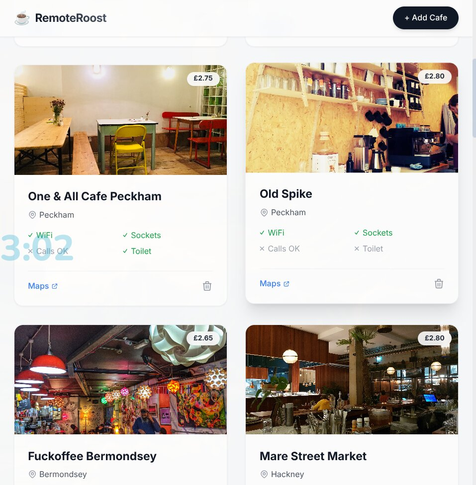

# RemoteRoost ☕💻

**RemoteRoost** is a production-grade directory web application designed for digital nomads and remote workers to find the best cafes with reliable WiFi, great coffee, and a perfect work environment.

Built with Python and Flask, this project demonstrates strong backend fundamentals, database architecture, and a modern, responsive frontend layout.

---

## 📸 Preview




## 🚀 Live Demo / Features

- **Dynamic Data Rendering:** Real-time fetching and display of cafe records from a SQL database.
- **Secure Data Entry:** Flask-WTF forms integrated with CSRF protection for creating new cafe listings.
- **Admin Authentication:** Mock API key validation required for destructive actions (e.g., Deleting a cafe).
- **Modern UI/UX:** Clean, responsive design built with Tailwind CSS, featuring subtle micro-interactions and smooth transitions to emulate a premium product feel.
- **Robust Error Handling:** Custom 404 and 500 error pages, with graceful degradation on database connection failures.

## 🏗️ Architecture & Tech Stack

### Backend
- **Framework:** [Flask](https://flask.palletsprojects.com/) (Python)
- **Database ORM:** [Flask-SQLAlchemy](https://flask-sqlalchemy.palletsprojects.com/)
- **Form Handling & Validation:** [Flask-WTF](https://flask-wtf.readthedocs.io/) and WTForms
- **Database:** SQLite (`cafes.db`) for lightweight, portable deployment. Can be easily swapped to PostgreSQL for production.

### Frontend
- **Templating Engine:** Jinja2
- **Styling:** [Tailwind CSS](https://tailwindcss.com/) (via CDN for rapid prototyping) combined with custom CSS for specialized animations.
- **Fonts:** Google Fonts (Inter)

## 🗄️ Database Schema

The SQLite database (`cafes.db`) utilizes a single `cafe` table with the following structure:

| Column | Type | Description |
| :--- | :--- | :--- |
| `id` | `INTEGER` | Primary Key |
| `name` | `VARCHAR(250)` | Name of the cafe (Unique) |
| `map_url` | `VARCHAR(500)` | Google Maps URL |
| `img_url` | `VARCHAR(500)` | Image URL for the cafe |
| `location` | `VARCHAR(250)` | Neighborhood or City |
| `has_sockets` | `BOOLEAN` | Power sockets availability |
| `has_toilet` | `BOOLEAN` | Restroom availability |
| `has_wifi` | `BOOLEAN` | Reliable WiFi availability |
| `can_take_calls`| `BOOLEAN` | Environment suitable for calls |
| `seats` | `VARCHAR(250)` | Approximate seating capacity |
| `coffee_price` | `VARCHAR(250)` | Average coffee price |

## 🛠️ Local Installation & Setup

1. **Clone the repository** (if applicable) or navigate to the project folder.
   ```bash
   git clone https://github.com/azeemsher788/Cafe-website.git
   cd Cafe-website
   ```

2. **Create a Virtual Environment** (Recommended)
   ```bash
   python3 -m venv venv
   source venv/bin/activate  # On Windows use `venv\Scripts\activate`
   ```

3. **Install Dependencies**
   Ensure you have the required packages installed:
   ```bash
   pip install Flask Flask-SQLAlchemy Flask-WTF WTForms
   ```
   *(Note: You can also generate a `requirements.txt` via `pip freeze > requirements.txt`)*

4. **Database Setup**
   The project includes a pre-populated SQLite database (`cafes.db`). The SQLAlchemy model maps directly to this existing table.

5. **Run the Application**
   ```bash
   python app.py
   ```
   The application will be running on `http://127.0.0.1:5000/`.

## 🔒 Security Notes

- **CSRF Protection:** All POST forms require a valid CSRF token, managed seamlessly by Flask-WTF.
- **Admin Actions:** Deleting a cafe currently requires a hardcoded API Key (`TopSecretAdminKey`). In a production environment, this should be replaced with a robust User Authentication system (e.g., Flask-Login) and Role-Based Access Control (RBAC) tied to environment variables.
- **Environment Variables:** Secrets like `SECRET_KEY` and database URIs are structured to fall back to environment variables for secure production deployments.

## 🤝 Contact

Created to showcase clean code, modular architecture, and Full-Stack capabilities. For freelance inquiries or technical roles, please reach out via my portfolio.
